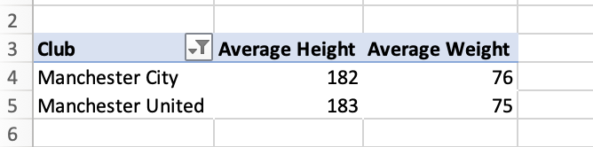

# Premier-League-Stats
Explaining and providing insight into some statistics about the Premier League which is the Top Football league in England, the best football league in Europe.

## Introduction
This task of data analysis was done using an Excel spreadsheet. In this analysis, Pivot Tables were used to analyze statistics of players in the English Premier League which is the top professional football league in England for the 2022/2023 season. The data provided was complete and can be seen in the file called **Premier league stats.csv**.

## Problem Statement
To solve and provide solutions to the following problems and questions.
1. What players have the top 5 total stats in the season?
2. Which club has the youngest squad based on the average age of players?
3. What is the nationality breakdown of players in the Premier League?
4. What is the overall rating distribution of players from Arsenal in the database?
5. What is the average height and weight of players playing in Machester in the Premier League?
6. What 10 teams in the league pay the highest salaries?

## Skills Demonstrated
1. Data Processing
2. Use of Sum Function
3. Use of Count Function
4. Use of Average Function
5. Pivot Table
7. Data Visualization

## Data Analysis
The data provided was complete and can be seen in the file called **Premier league stats.csv**. As the data provided was complete, it made it easier for me to carry out my analysis. The data was a very large dataset with                                         
Columns = 90                                                                                                                      
Rows = 696
After this, I then used Pivot Table to solve and answer the medical questions and problems.

To create a Pivot table, 
- We select the whole table
- Then click on the Insert Tab
- Select Pivot Table
- Choose a new worksheet
- Then, it takes you to a new worksheet.

1. For the players who had the top 5 total stats in the season, drag the Full name into Rows and then drag the total stats into Values. Then filter to get the top 5 players with the highest stats.
Joe Aribo had the highest stats among all the players that played in the Premier League in the 2022/2023 season.

2. For the club with the youngest squad based on the average age of players, you drag the clubs into Rows and then drag the Age into Values. To get the average, right-click on all the columns and change the aggregation from sum to average.
Brighton has the least average age at 23 while Everton, West Ham United, Fulham, Nottingham Forest, Newcastle United and Liverpool at 26.

3. To find out the top 5 nationality breakdowns of players in the Premier League in terms of percentage, you drag the nationality into Rows and then drag the nationality into Values. To get the count, right-click on all the columns and change the aggregation from sum to count.
England is the country with the highest amount of players in the English Premier League.

4. For the overall rating distribution of players from Arsenal in the database, you drag the Full name into Rows, the club into Columns and then drag the overall into Values.
Martin Odegaard and Thomas Partey have the highest overall ratings among the Arsenal squad while Lino Sousa has the lowest overall rating at 56. 

5. For the average height and weight of players playing in Machester in the Premier League, you drag the club into Rows, and the height and weight into Columns. To get the average, right-click on all the columns and change the aggregation from sum to average.
Manchester United has an average height of 183, one higher than Manchester City at 182, while Manchester City has an average weight of 76, one higher than Manchester United at 75.

6. For 10 teams in the league that pay the highest salaries, you drag the club into Rows, and the total wage EUR into Columns. Then you filter to select the top 10 clubs/teams that pay the highest.
Manchester City is the club and team with the highest salary in the Premier League.

The visuals below show and explain better our findings and solution to the problems 1 - 6 we are trying to solve which is our problem statement 1 - 6.

The visuals for the players who had the top 5 total stats in the season.

The visuals for the club that has the youngest squad based on the average age of players.

The visuals for the nationality breakdown of players that play in the Premier League.

The visuals for the overall rating distribution of players from Arsenal in the league.

The visuals for the average height and weight of players playing in Machester in the Premier League which means players playing for Manchester United and Manchester City.

The visuals for the Top 10 teams in the league pay the highest salaries to their players.

## Conclusion
This is my data analysis task using data to tell a story. Carrying out this analysis was made so easy with the use of the Pivot Table in Excel. As long as you know which field name to put into the Filters, Columns, Rows and Values and you put them into the section.
Joe Aribo had the highest stats among all the players that played in the Premier League in the 2022/2023 season.
# Note
Brighton has the least average age at 23 while Everton, West Ham United, Fulham, Nottingham Forest, Newcastle United and Liverpool at 26.
England is the country with the highest amount of players in the English Premier League.
Martin Odegaard and Thomas Partey have the highest overall ratings among the Arsenal squad while Lino Sousa has the lowest overall rating at 56. 
Manchester United has an average height of 183, one higher than Manchester City at 182, while Manchester City has an average weight of 76, one higher than Manchester United at 75.
Manchester City is the club and team with the highest salary in the Premier League.
